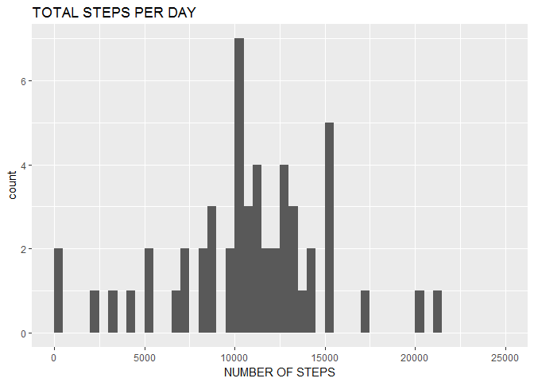
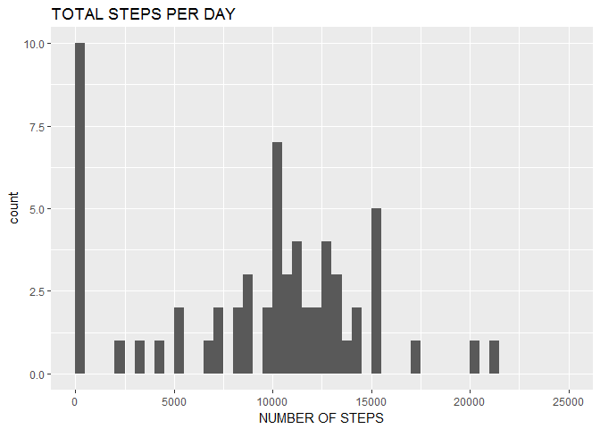
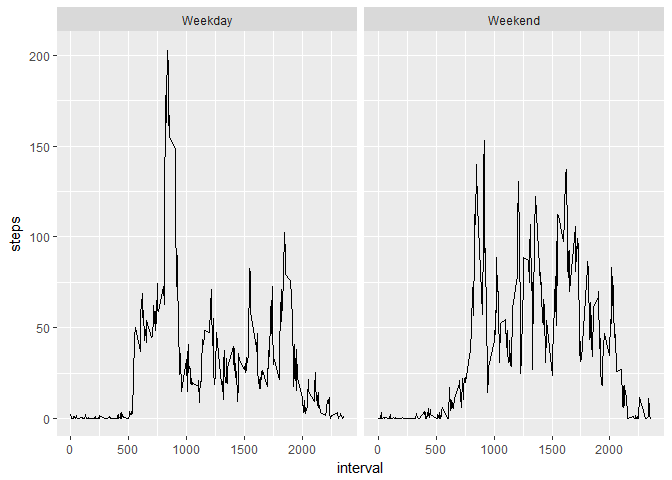

# Reproducible Research: Peer Assessment 1


## Loading and preprocessing the data

```r
unzip.act <- unzip('activity.zip')
act <- read.csv(unzip.act)
library(tidyverse)
```

```
## Warning: package 'tidyverse' was built under R version 3.3.3
```

```
## Loading tidyverse: ggplot2
## Loading tidyverse: tibble
## Loading tidyverse: tidyr
## Loading tidyverse: readr
## Loading tidyverse: purrr
## Loading tidyverse: dplyr
```

```
## Warning: package 'ggplot2' was built under R version 3.3.3
```

```
## Warning: package 'tibble' was built under R version 3.3.3
```

```
## Warning: package 'readr' was built under R version 3.3.3
```

```
## Warning: package 'dplyr' was built under R version 3.3.3
```

```
## Conflicts with tidy packages ----------------------------------------------
```

```
## filter(): dplyr, stats
## lag():    dplyr, stats
```

```r
library(dplyr)
library(ggplot2)
library(readr)
```


## What is mean total number of steps taken per day?

```r
act.sum.sum <- summarize(group_by(act, date), steps = sum(steps))
```
Here is a histogram of the total number of steps taken each day.


```r
ggplot(act.sum.sum, mapping = aes(x = steps))+
  geom_histogram(breaks = seq.int(from = 0, to = 25000, by = 500), na.rm = TRUE)+
  labs(title = "TOTAL STEPS PER DAY", x = "NUMBER OF STEPS")
```

<!-- -->

The mean number of steps taken each day is 10766. 

The median number of steps taken each day is 10765.

## What is the average daily activity pattern?

```r
#this is the calculation for the average daily step pattern
act.sum.mean <- summarize(group_by(act, interval), steps = mean(steps, na.rm = TRUE))
#this code finds the time interval with the maximum average steps 
max.int <- act.sum.mean[which.max(act.sum.mean$steps),1]
```
Here is a time series plot of the average number of steps taken.

```r
ggplot(data = act.sum.mean, mapping = aes(x = interval, y = steps))+
  geom_line()
```

<!-- -->

The 5-minute interval, on average across all the days in the dataset,that contains the maximum number of steps is 835.

## Imputing missing values

```r
#this code replaces a NA with a zero
imp.act <- mutate(act, steps = ifelse(is.na(act$steps),0 ,act$steps))
```

```
## Warning: package 'bindrcpp' was built under R version 3.3.3
```

```r
#this code counts the number of NAs in the datatset
incomplete <- sum(!complete.cases(act))
#this code summarizes the dataset with zeros instead of NAs
imp.act.sum <- summarize(group_by(imp.act, date), steps = sum(steps))
```
The total number of missing values in the dataset is 2304.

I decided to replace any NA with a zero.

Here is a histogram of the total number of steps taken each day with zeros instead of NA.

```r
ggplot(imp.act.sum, mapping = aes(x = steps))+
  geom_histogram(breaks = seq.int(from = 0, to = 25000, by = 500), na.rm = TRUE)+
  labs(title = "TOTAL STEPS PER DAY", x = "NUMBER OF STEPS")
```

<!-- -->

The mean number of steps taken each day with zeros instead of NA is 9354.

The median number of steps taken each day with zeros instead of NA is 10395.


## Are there differences in activity patterns between weekdays and weekends?
Here is a time series plot of the average number of steps taken faceted by weekday or weekend.

```r
#this is the calculation for the total number of steps taken per day with zeros instead of NA.
imp.act.sum <- summarize(group_by(imp.act, date), steps = sum(steps))

weekdays <- c("Monday", "Tuesday", "Wednesday", "Thursday", "Friday")

imp.act$dow = as.factor(ifelse(is.element(weekdays(as.Date(imp.act$date)),weekdays), "Weekday", "Weekend"))

imp.act.int <- summarize(group_by(imp.act, interval, dow), steps = mean(steps, na.rm = TRUE))
# here is a faceted plot of the average number of steps taken separated by weekdays or weekends 
ggplot(data = imp.act.int, mapping = aes(x = interval, y = steps))+
  geom_line()+
  facet_grid(.~dow)
```

<!-- -->

